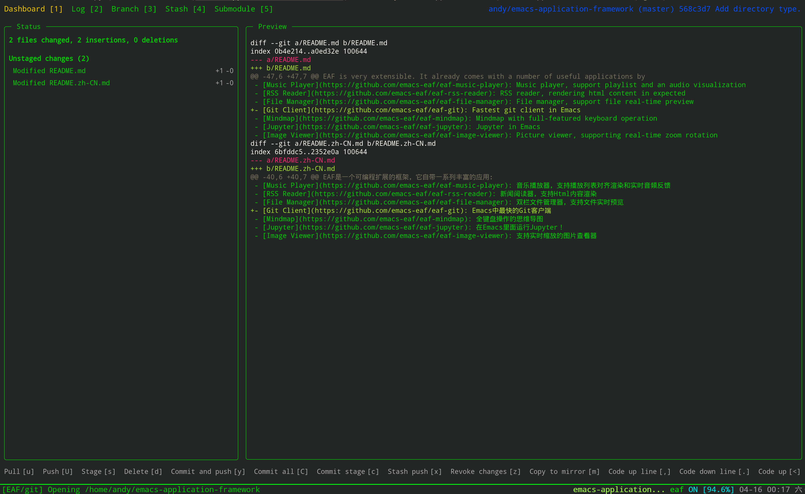

# EAF Git Client
<p align="center">
  
</p>

EAF Git is git client application for the [Emacs Application Framework](https://github.com/emacs-eaf/emacs-application-framework).

The advantages of EAF Git are:

1. Large log browse: support 1 million logs browsing and search, completely cover the most of Git repository in the world (such as Linux kernel)
2. Ultra-high performance: the design will make full use of multi-threaded technology, never block Emacs
3. Friendly GUI: press the top key to switch different application scenarios, bottom of each page has help documentation, you can use it on the first day, do not need any learning threshold
4. Log comparison window: when the log page is pressed by the 'i' key, it will display other branch logs for Rebase and Cherry-Pick, you don't need to return the branch to check the log for confirmation
5. Submodule full support: in addition to basic addition and deletion, including submodules updates and version rollback are built-in, support for Submodule sub-paths
6. There are still a lot of sweet features, such as one-click push, automatically revoked the last commit...

### Load application

[Install EAF](https://github.com/emacs-eaf/emacs-application-framework#install) first, then add below code in your emacs config:

```Elisp
(add-to-list 'load-path "~/.emacs.d/site-lisp/emacs-application-framework/")
(require 'eaf)
(require 'eaf-git)
```

